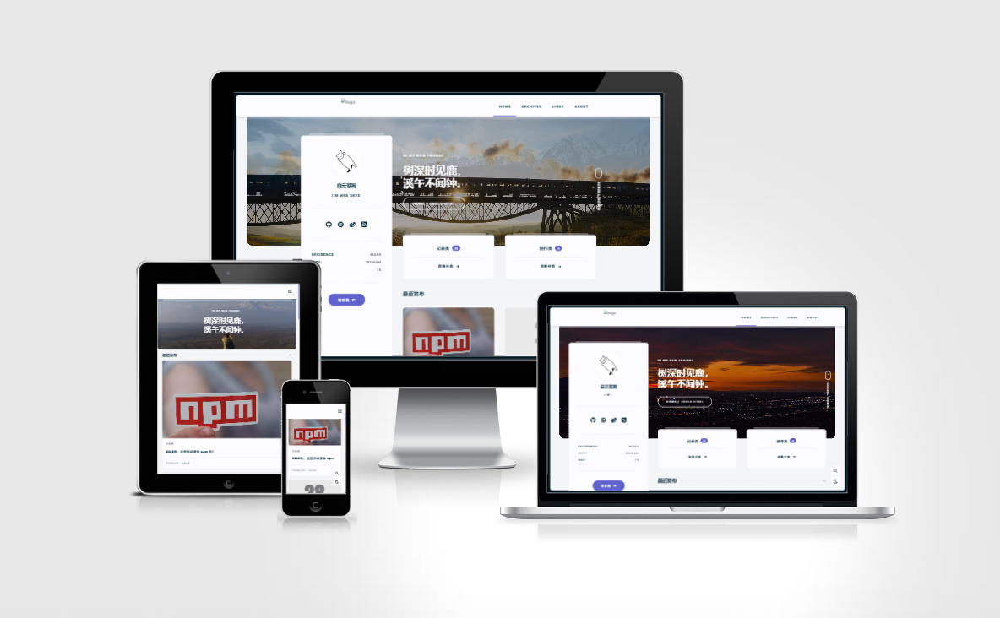

<h1 align="center">hexo-theme-async</h1>

<div align="center">

[Gitee](https://gitee.com/ml13/hexo-theme-async) ｜
[演示](https://hexo-theme-async.imalun.com/demosite/) ｜
[示例预览](https://www.imalun.com) ｜
[使用文档](https://hexo-theme-async.imalun.com/)

一个简单而轻量级的 Hexo 主题。

</div>

<p align="center">
  <a title="Github release" target="_blank" href="https://github.com/MaLuns/hexo-theme-async/releases">
    
  </a>
  <a title="Npm Version" target="_blank" href="https://www.npmjs.com/package/hexo-theme-async">
    
  </a>
  <a title="Hexo Version" target="_blank" href="https://hexo.io/zh-cn/">
    
  </a>
	
  
  <a title="GitHub Discussions" target="_blank" href="https://github.com/MaLuns/hexo-theme-async/discussions">
    
  </a>
  <a title="SATA License" target="_blank" href="https://github.com/zTrix/sata-license">
    
  </a>
</p>

<p align="center">
  🇨🇳 中文简体  |  
  <a title="English" href="README.md">🇬🇧 English</a>
</p>

<p align="center">
  
</p>

## 文档

一份详细的使用文档，能解决你大部分不清楚地方了🤣

- 中文文档：
    - <https://hexo-theme-async.imalun.com> (dev)
    - <https://async-docs.imalun.com> (master)
- 英文文档：
    - <https://hexo-theme-async.imalun.com/en/guide/> (dev)
    - <https://async-docs.imalun.com/en/guide/> (master)

## 安装

安装 hexo-theme-async、less、ejs 等插件

``` bash
npm install --save hexo-theme-async hexo-renderer-less hexo-renderer-ejs
```

或者

``` bash
yarn add --save hexo-theme-async hexo-renderer-less hexo-renderer-ejs
```

您可以创建一个 \_config.async.yml 来覆盖主题默认 \_config.yml  中配置，可以参考 [Hexo Docs](https://hexo.io/zh-cn/docs/configuration#%E4%BD%BF%E7%94%A8%E4%BB%A3%E6%9B%BF%E4%B8%BB%E9%A2%98%E9%85%8D%E7%BD%AE%E6%96%87%E4%BB%B6)

## 更新

你只需要执行:

``` bash
npm install hexo-theme-async@latest
```
## 参与贡献
非常欢迎你的贡献，你可以通过以下方式一起共建 :smiley:：

- 遇到 Bug 通过提交 [Issue](https://github.com/MaLuns/hexo-theme-async/issues) 报告。
- 有建议和疑问欢迎前往 [Discussions](https://github.com/MaLuns/hexo-theme-async/discussions) 讨论。
- 提交 Pull Request 改进 **Hexo-theme-async** 的代码。


## 协议

本主题采用 [SATA License](https://github.com/zTrix/sata-license)。

> 你不知道这代表什么？简单来说，就是如果你使用了该主题，你需要马不停蹄地点一个 Star，接下来你便可以随意使用它。

## 演示站点

如果你已经使用了本主题，欢迎前往 [Demo Sites | 示例站点 | Discussions](https://github.com/MaLuns/hexo-theme-async/discussions/7) 留下你的站点，我将会将其添加到下方的示例站点中。

也可以直接修改 [sites.json](https://github.com/MaLuns/hexo-theme-async/blob/dev/docs/.vitepress/assets/sites.json) 创建 PR。

<!-- demo-start -->
<table>
  <tr align="center">
        <td>
            <a href="https://hexo-theme-async.imalun.com/demosite/" target="_blank">
                
                <br />
                <sub title="主题默认示例">默认示例</sub>
            </a>
        </td>
        <td>
            <a href="https://www.imalun.com" target="_blank">
                
                <br />
                <sub title="醒，亦在人间；梦，亦在人间。">白云苍狗</sub>
            </a>
        </td>
        <td>
            <a href="https://yxy.imalun.com" target="_blank">
                
                <br />
                <sub title="两人对酌山花开，一杯一杯复一杯。我醉欲眠卿且去，明朝有意抱琴来。">游小游</sub>
            </a>
        </td>
        <td>
            <a href="https://grainrain.site/" target="_blank">
                
                <br />
                <sub title="世事漫随流水 算来一生浮梦">谷雨</sub>
            </a>
        </td>
        <td>
            <a href="https://blog.offends.cn" target="_blank">
                
                <br />
                <sub title="现充爆炸吧">Offends</sub>
            </a>
        </td>
        <td>
            <a href="https://hexo.yahoo94.love" target="_blank">
                
                <br />
                <sub title="再过十年，我们还是过着今天。">乌冬</sub>
            </a>
        </td>
        <td>
            <a href="https://blog.gfxgy.cn/" target="_blank">
                
                <br />
                <sub title="桃之夭夭，灼灼其华。">怵.</sub>
            </a>
        </td>
        <td>
            <a href="https://www.tacg.ink/" target="_blank">
                
                <br />
                <sub title="记录生活，找寻生活的方向">TACG</sub>
            </a>
        </td>
    </tr>
    <tr align="center">
        <td>
            <a href="https://blog.shawn404.top/" target="_blank">
                
                <br />
                <sub title="Strive hard and work novelty">Shawn's Blog</sub>
            </a>
        </td>
				<td>
            <a href="https://dracewang.github.io/" target="_blank">
                
                <br />
                <sub title="江湖险恶，不行就撤">Hexagon</sub>
            </a>
        </td>
				<td>
            <a href="https://cyphersun.github.io/" target="_blank">
                
                <br />
                <sub title="吾日百省，知行合一">Cypher Sun</sub>
            </a>
        </td>
      </tr>
</table>
<!-- demo-end -->